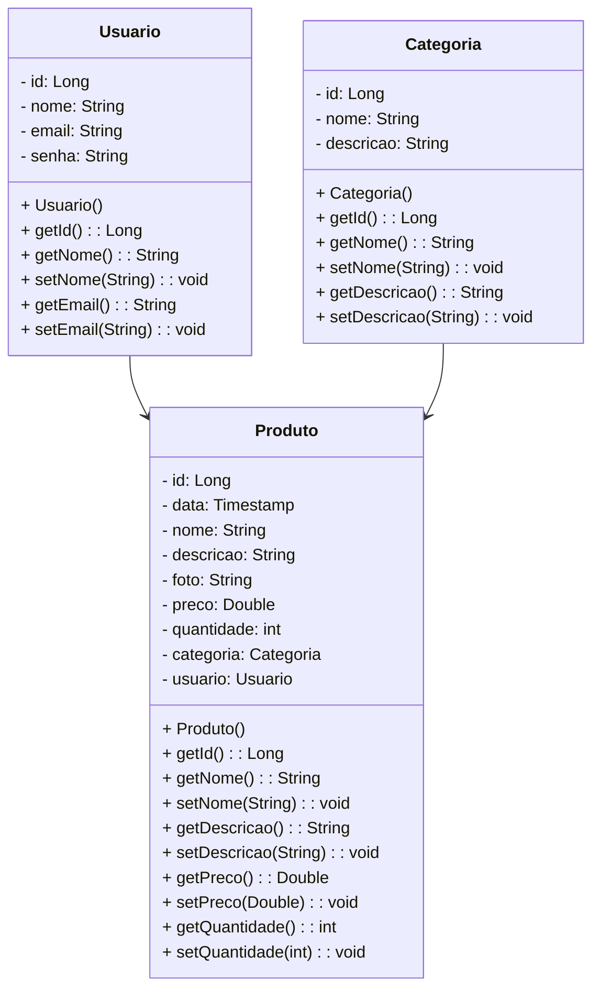

  <header class="center">
    <h1><strong>PG 2 — Backend com Spring Boot: Farmácia Bem Estar</strong></h1>
    

      
    

    

      
      
      
      
    

  </header>

  <section>
    <h2><strong>📚 Descrição</strong></h2>
    

      <strong>Farmácia Bem Estar</strong> é um sistema de <strong>e-commerce</strong> para produtos de farmácia e bem-estar, desenvolvido em <strong>Java com Spring Boot</strong>.
      A aplicação oferece cadastro, listagem, consulta, atualização e remoção de produtos, categorias e usuarios e gerencia relacionamentos entre as entidades:
    

    <ul>
      <li><strong>Usuário → Produto</strong>: cada produto é vinculado a um usuário (quem cadastrou).</li>
      <li><strong>Categoria → Produto</strong>: cada produto pertence a uma categoria.</li>
    </ul>
    

      A API inclui <strong>segurança via JWT</strong>, com métodos privados exigindo autenticação. Um usuário <strong>root</strong> genérico é fornecido para testes iniciais.
      O projeto tem fins educacionais e demonstra conceitos de POO, Spring Boot, JPA e autenticação em API REST.
    

  </section>

  <section>
    <h2><strong>🚀 Funcionalidades</strong></h2>
    <ul>
      <li><strong>CRUD Produtos</strong> — criar, listar, consultar (por id/nome), atualizar e excluir produtos.</li>
      <li><strong>CRUD Categorias</strong> — criar, listar, atualizar e excluir categorias.</li>
      <li><strong>CRUD Usuários</strong> — gerenciar usuários (acesso de administração/root para operações sensíveis).</li>
      <li><strong>Segurança JWT</strong> — endpoints privados protegidos por token (Authorization: Bearer &lt;token&gt;).</li>
    </ul>
  </section>

  <section>
    <h2><strong>🛠️ Tecnologias</strong></h2>
    <ul>
      <li>Java 17</li>
      <li>Spring Boot 3.5</li>
      <li>Spring Security (JWT)</li>
      <li>Spring Data JPA / Hibernate</li>
      <li>Banco relacional (MySQL)</li>
      <li>Maven</li>
    </ul>
  </section>

  <section>
    <h2><strong>📂 Estrutura do Projeto</strong></h2>
    <pre><code>
src
 └─ main
     ├─ java
     │   └─ com.generation.farmacia
     │        ├─ controller
     │        ├─ model
     │        ├─ repository
     │        ├─ service
     │        └─ security
     └─ resources
         ├─ application.properties
    </code></pre>
  </section>

  <section>
    <h2><strong>📘 Diagramas</strong></h2>

<h3><strong>Diagrama de Classes</strong></h3>

O bloco abaixo contém o diagrama de classes em formato Mermaid — ele pode ser renderizado por ferramentas que suportem Mermaid.

<h3><strong>Diagrama Entidade-Relacional (DER)</strong></h3>

<pre><code class="language-mermaid">
 
erDiagram
USUARIO ||--o{ PRODUTO : "cadastra"
CATEGORIA ||--o{ PRODUTO : "classifica"

USUARIO {
  Long id
  String nome
  String email
  String senha
}

CATEGORIA {
  Long id
  String nome
  String descricao
}

PRODUTO {
  Long id
  Timestamp data
  String nome
  String descricao
  String foto
  Double preco
  int quantidade
  Long categoria_id
  Long usuario_id
}

  

    </code></pre>

</section>

  <section>
    <h2><strong>✨ Slogan</strong></h2>
    
<strong>“Farmácia Bem Estar — Cuidando da sua saúde com confiança e praticidade!”</strong>

  </section>

  <section>
    <h2><strong>📌 Requisitos</strong></h2>
    <ul>
      <li>Java JDK 17+</li>
      <li>IDE: Eclipse / STS / IntelliJ IDEA</li>
      <li>Banco: MySQL</li>
      <li>Maven</li>
      <li>Ferramenta de testes: Insomnia / Postman</li>
    </ul>
  </section>

  <section>
    <h2><strong>❗Como Executar (local)</strong></h2>
    <ol>
      <li><strong>Clonar o repositório</strong>:
        <pre><code>git clone git@github.com:cdouradom/farmacia_bem_estar.git</code></pre>
      </li>
      <li><strong>Configurar banco</strong>: atualize o arquivo <code>src/main/resources/application.properties</code> com suas credenciais e URL do banco.</li>
      <li><strong>Importar na IDE</strong>: importe como projeto Maven/Gradle e aguarde a indexação.</li>
      <li><strong>Executar</strong>: rode a classe principal <code>FarmaciaApplication.java</code>.</li>
      <li><strong>Testar</strong>: use Insomnia/Postman para acessar os endpoints.</li>
    </ol>
  </section>

  <section>
    <h2><strong>💬  Contribuição</strong></h2>
    

      Este repositório é educacional. Contribuições são bem-vindas:
    

    <ul>
      <li>Criar <strong>issue</strong> descrevendo bug ou sugestão.</li>
      <li>Enviar <strong>pull request</strong> com melhorias.</li>
      <li>Adicionar testes, documentação ou scripts para dev/CI.</li>
    </ul>
  </section>

  <footer>
    <h3><strong> 👩‍💻 Autora</strong></h3>
    
<strong>Cíntia Marques Dourado</strong>

    
Email: <a href="mailto:cdouradom@gmail.com">cdouradom@gmail.com</a>

    
GitHub: <a href="https://github.com/cdouradom" target="_blank" rel="noopener">cdouradom</a>

  </footer>

</body>
</html>
